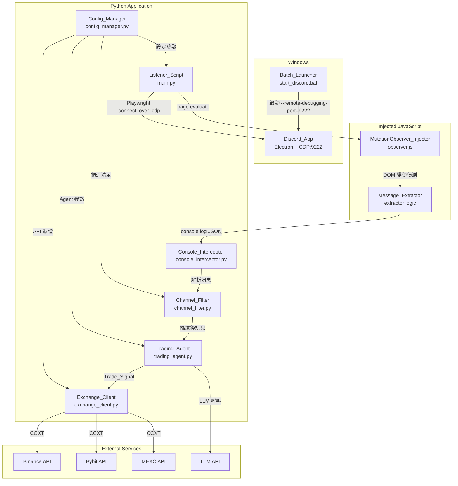
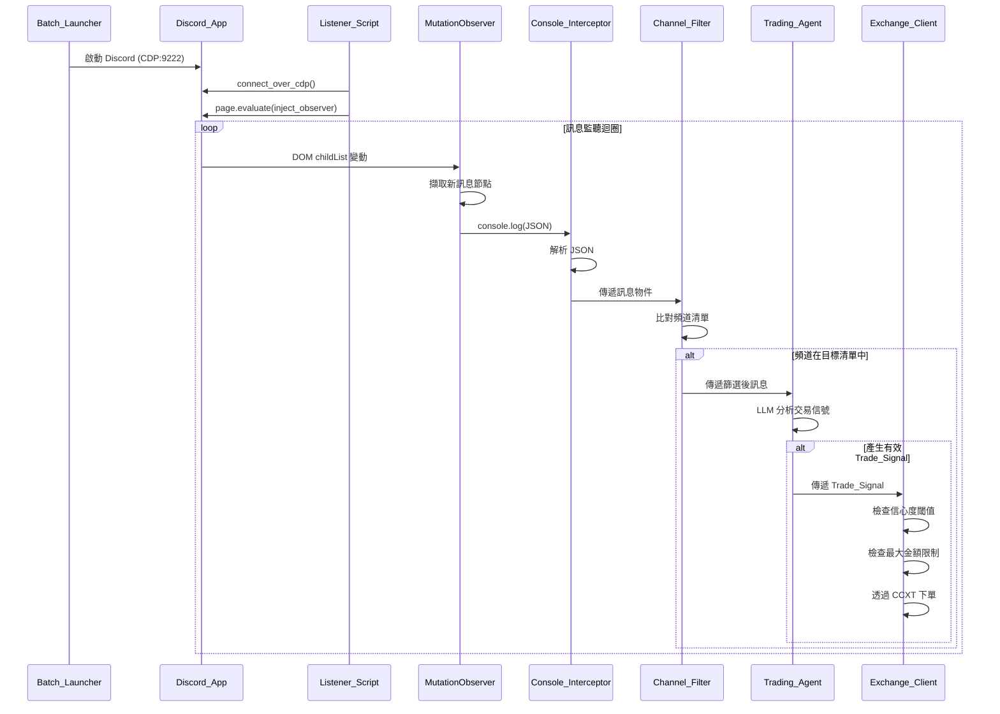
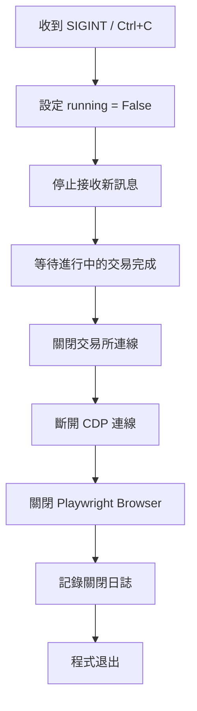

# 設計文件：Discord 訊息監聽與自動交易工具

## 概述

本工具是一個 Python 應用程式，透過 Chrome DevTools Protocol (CDP) 連接至以 Debug 模式啟動的 Discord 桌面應用程式，注入 JavaScript MutationObserver 監聽聊天 DOM 變動，擷取特定頻道的新訊息後交由 AI Agent 分析交易信號，最終透過 CCXT 統一介面在 Binance、Bybit、MEXC 交易所執行下單。

系統採用事件驅動架構，以 Playwright 的 `page.on("console")` 作為 JavaScript 與 Python 之間的橋樑，實現低延遲的訊息傳遞。設定檔採用 YAML 格式，所有敏感資訊（API Key）集中管理。預設以只讀模式運行，確保合規性。

## 架構

### 系統架構圖



### 資料流程



### 設計決策

1. **Playwright over Selenium**：Playwright 原生支援 CDP 連線（`connect_over_cdp`），且對 Electron 應用有更好的支援，API 更現代化。
2. **console.log 作為通訊橋樑**：相較於 CDP 的 `Runtime.evaluate` 輪詢，利用 MutationObserver + console.log + `page.on("console")` 是純事件驅動的，零輪詢開銷，符合需求 11 的低頻存取要求。
3. **CCXT 統一交易介面**：CCXT 提供統一的 API 介面支援 100+ 交易所，避免為 Binance、Bybit、MEXC 各自實作不同的 API 客戶端，大幅降低維護成本。
4. **YAML 設定檔**：相較於 JSON，YAML 支援註解且可讀性更高，適合包含多個區塊的設定檔。
5. **語義化 DOM Selector**：使用 `role="article"`、`aria-label` 等穩定屬性，避免 Discord 混淆的 class name，提升跨版本穩定性。

## 元件與介面

### 1. Batch_Launcher (`start_discord.bat`)

Windows Batch 腳本，負責以 Debug 模式啟動 Discord。

**介面：**
- 輸入：無（直接執行）
- 輸出：啟動 Discord 並開啟 CDP Port 9222
- 行為：
  - 檢查 Discord 是否已在執行（透過 `tasklist` 指令）
  - 若已執行，顯示提示訊息並退出
  - 若未執行，以 `--remote-debugging-port=9222` 參數啟動 Discord
  - 顯示 CDP 連線資訊

### 2. Config_Manager (`config_manager.py`)

負責載入、驗證及管理 YAML 設定檔。

```python
from dataclasses import dataclass, field
from typing import Optional

@dataclass
class ExchangeConfig:
    name: str                    # "binance", "bybit", "mexc"
    api_key: str = ""
    api_secret: str = ""
    enabled: bool = False

@dataclass
class TradingConfig:
    confidence_threshold: int = 70       # 0-100
    max_trade_amount_usdt: float = 100.0
    enabled_exchanges: list[str] = field(default_factory=list)

@dataclass
class AppConfig:
    cdp_url: str = "http://localhost:9222"
    target_channels: list[str] = field(default_factory=list)
    exchanges: list[ExchangeConfig] = field(default_factory=list)
    trading: TradingConfig = field(default_factory=TradingConfig)
    read_only_mode: bool = True
    llm_model: str = "gpt-4o-mini"
    llm_api_key: str = ""

class ConfigManager:
    def load(self, path: str) -> AppConfig:
        """從 YAML 檔案載入設定，若檔案不存在則產生範例設定檔。"""
        ...

    def validate(self, config: AppConfig) -> list[str]:
        """驗證設定檔，回傳錯誤訊息清單。空清單表示驗證通過。"""
        ...

    def generate_default(self, path: str) -> None:
        """產生包含預設值的範例設定檔。"""
        ...
```

### 3. Console_Interceptor (`console_interceptor.py`)

攔截 Playwright page 的 console 事件，解析 JSON 訊息資料。

```python
from dataclasses import dataclass
from typing import Optional, Callable
import json

@dataclass
class DiscordMessage:
    author: str
    content: str
    timestamp: str
    channel: str

class ConsoleInterceptor:
    def __init__(self, on_message: Callable[[DiscordMessage], None]):
        self.on_message = on_message

    def handle_console(self, msg) -> None:
        """處理 Playwright ConsoleMessage 事件。
        嘗試解析 JSON，若為有效訊息則呼叫 on_message callback。
        非訊息 JSON 或無效格式則靜默忽略。
        """
        ...

    @staticmethod
    def parse_message(json_str: str) -> Optional[DiscordMessage]:
        """將 JSON 字串解析為 DiscordMessage。
        回傳 None 表示非有效訊息格式。
        """
        ...

    @staticmethod
    def serialize_message(message: DiscordMessage) -> str:
        """將 DiscordMessage 序列化為 JSON 字串。"""
        ...
```

### 4. Channel_Filter (`channel_filter.py`)

根據設定檔中的目標頻道清單篩選訊息。

```python
import logging

class ChannelFilter:
    def __init__(self, target_channels: list[str]):
        self.target_channels = target_channels

    def should_process(self, channel_name: str) -> bool:
        """判斷該頻道是否在目標清單中。
        若目標清單為空，記錄警告並回傳 False。
        """
        ...

    def filter_message(self, message: DiscordMessage) -> Optional[DiscordMessage]:
        """篩選訊息。通過篩選回傳訊息，否則回傳 None。"""
        ...
```

### 5. MutationObserver_Injector（JavaScript，透過 `page.evaluate` 注入）

注入至 Discord 頁面的 JavaScript 程式碼。

```javascript
// 注入腳本的虛擬碼結構
function injectObserver() {
    // 1. 找到聊天列表容器（使用語義化 selector）
    //    優先使用 [role="list"][data-list-id="chat-messages"]
    //    或 ol[data-list-id="chat-messages"]
    
    // 2. 確保捲動位置在底部
    //    scrollContainer.scrollTop = scrollContainer.scrollHeight
    
    // 3. 建立 MutationObserver
    const observer = new MutationObserver((mutations) => {
        for (const mutation of mutations) {
            for (const node of mutation.addedNodes) {
                if (node.nodeType !== Node.ELEMENT_NODE) continue;
                
                // 4. 從新增節點擷取訊息資料
                //    使用 [role="article"] 定位訊息元素
                const articles = node.querySelectorAll
                    ? node.querySelectorAll('[role="article"]')
                    : [];
                
                // 若 node 本身就是 article
                if (node.matches && node.matches('[role="article"]')) {
                    extractAndLog(node);
                }
                articles.forEach(extractAndLog);
            }
        }
    });
    
    // 5. 開始觀察
    observer.observe(chatContainer, {
        childList: true,
        subtree: true
    });
    
    // 6. 定期檢查捲動位置（低頻率，每 5 秒）
    setInterval(() => {
        const scroller = document.querySelector('[class*="scroller"]');
        if (scroller) {
            const isAtBottom = scroller.scrollHeight - scroller.scrollTop 
                             - scroller.clientHeight < 50;
            if (!isAtBottom) {
                scroller.scrollTop = scroller.scrollHeight;
            }
        }
    }, 5000);
}

function extractAndLog(articleNode) {
    // 從 article 節點擷取：
    // - author: 從 aria-label 或 header 元素
    // - content: 從訊息內容區域
    // - timestamp: 從 time 元素的 datetime 屬性
    // - channel: 從頁面標題或頻道名稱元素
    const data = {
        type: "DISCORD_MESSAGE",
        author: extractAuthor(articleNode),
        content: extractContent(articleNode),
        timestamp: extractTimestamp(articleNode),
        channel: extractChannel()
    };
    console.log(JSON.stringify(data));
}
```

### 6. Trading_Agent (`trading_agent.py`)

AI Agent 元件，使用 LLM 分析訊息並產生交易信號。

```python
from dataclasses import dataclass
from typing import Optional

@dataclass
class TradeSignal:
    symbol: str          # e.g. "BTC/USDT"
    side: str            # "BUY" or "SELL"
    confidence: int      # 0-100
    summary: str         # 分析總結

class TradingAgent:
    def __init__(self, model: str, api_key: str):
        self.model = model
        self.api_key = api_key

    async def analyze(self, message: DiscordMessage) -> Optional[TradeSignal]:
        """分析訊息內容，產生交易信號。
        若無法判斷明確信號，回傳 None 並記錄分析結果。
        """
        ...

    def _build_prompt(self, message: DiscordMessage) -> str:
        """建構 LLM 分析用的 prompt。"""
        ...

    def _parse_response(self, response: str) -> Optional[TradeSignal]:
        """解析 LLM 回應為 TradeSignal。"""
        ...
```

### 7. Exchange_Client (`exchange_client.py`)

透過 CCXT 統一介面與交易所互動。

```python
import ccxt
import logging

class ExchangeClient:
    def __init__(self, exchanges_config: list[ExchangeConfig], 
                 trading_config: TradingConfig):
        self.exchanges: dict[str, ccxt.Exchange] = {}
        self.trading_config = trading_config
        self._init_exchanges(exchanges_config)

    def _init_exchanges(self, configs: list[ExchangeConfig]) -> None:
        """初始化已啟用的交易所連線。"""
        ...

    async def place_order(self, signal: TradeSignal, 
                          exchange_name: str) -> Optional[dict]:
        """根據 TradeSignal 在指定交易所下單。
        檢查信心度閾值和最大金額限制。
        回傳訂單詳情或 None（若跳過下單）。
        """
        ...

    def _check_confidence(self, signal: TradeSignal) -> bool:
        """檢查信號信心度是否達到閾值。"""
        return signal.confidence >= self.trading_config.confidence_threshold

    def _check_amount_limit(self, amount_usdt: float) -> bool:
        """檢查交易金額是否在限制內。"""
        return amount_usdt <= self.trading_config.max_trade_amount_usdt
```

### 8. Listener_Script (`main.py`)

主程式，負責串接所有元件。

```python
import asyncio
import signal

class ListenerScript:
    def __init__(self, config_path: str = "config.yaml"):
        self.config_manager = ConfigManager()
        self.config: Optional[AppConfig] = None
        self.running = False

    async def start(self) -> None:
        """主要啟動流程：
        1. 載入設定檔
        2. 顯示風險提示
        3. 連接 CDP
        4. 注入 MutationObserver
        5. 設定 console 事件監聽
        6. 進入監聽迴圈
        """
        ...

    def _show_risk_warning(self) -> None:
        """顯示風控與合規風險提示。"""
        ...

    async def _connect_cdp(self) -> None:
        """使用 Playwright connect_over_cdp 連接 Discord。
        逾時 30 秒。
        """
        ...

    async def _inject_observer(self) -> None:
        """注入 MutationObserver JavaScript。"""
        ...

    def _on_message(self, message: DiscordMessage) -> None:
        """訊息處理 callback：篩選 → 分析 → 下單。"""
        ...

    async def shutdown(self) -> None:
        """優雅關閉：斷開連線、釋放資源。"""
        ...
```

## 資料模型

### DiscordMessage（訊息資料結構）

JavaScript 與 Python 之間傳遞的訊息格式：

```json
{
    "type": "DISCORD_MESSAGE",
    "author": "TraderJoe",
    "content": "BTC 看多，目標 72000",
    "timestamp": "2024-01-15T10:30:00.000Z",
    "channel": "crypto-signals"
}
```

| 欄位 | 型別 | 說明 |
|------|------|------|
| type | string | 固定值 `"DISCORD_MESSAGE"`，用於區分其他 console log |
| author | string | 訊息發送者名稱 |
| content | string | 訊息文字內容 |
| timestamp | string | ISO 8601 格式時間戳記 |
| channel | string | 來源頻道名稱 |

### TradeSignal（交易信號資料結構）

```json
{
    "symbol": "BTC/USDT",
    "side": "BUY",
    "confidence": 85,
    "summary": "訊息明確提及 BTC 做多，目標價 72000，信心度高"
}
```

| 欄位 | 型別 | 說明 | 約束 |
|------|------|------|------|
| symbol | string | 交易對，如 `"BTC/USDT"` | 必須為有效的 CCXT 交易對格式 |
| side | string | 交易方向 | 僅限 `"BUY"` 或 `"SELL"` |
| confidence | int | 信心度 | 0-100 整數 |
| summary | string | 分析總結 | 非空字串 |

### AppConfig（設定檔結構）

```yaml
# config.yaml 範例
cdp_url: "http://localhost:9222"
read_only_mode: true

target_channels:
  - "crypto-signals"
  - "trading-alerts"

exchanges:
  - name: "binance"
    api_key: ""
    api_secret: ""
    enabled: false
  - name: "bybit"
    api_key: ""
    api_secret: ""
    enabled: false
  - name: "mexc"
    api_key: ""
    api_secret: ""
    enabled: false

trading:
  confidence_threshold: 70
  max_trade_amount_usdt: 100.0
  enabled_exchanges:
    - "binance"

llm:
  model: "gpt-4o-mini"
  api_key: ""
```

### 設定檔驗證規則

| 驗證項目 | 規則 |
|----------|------|
| target_channels | 不可為 null，可為空清單（觸發警告） |
| exchanges[].name | 必須為 "binance"、"bybit"、"mexc" 之一 |
| exchanges[].api_key | 若 enabled=true，不可為空 |
| trading.confidence_threshold | 0-100 整數 |
| trading.max_trade_amount_usdt | 正數 |
| read_only_mode | 布林值，預設 true |
| llm.api_key | 不可為空 |

## 正確性屬性（Correctness Properties）

*正確性屬性是一種在系統所有有效執行中都應成立的特徵或行為——本質上是關於系統應該做什麼的形式化陳述。屬性作為人類可讀規格與機器可驗證正確性保證之間的橋樑。*

以下屬性基於需求文件中的驗收條件推導而來，每個屬性都包含明確的「對所有」（for all）量化陳述，適合以 Property-Based Testing 實作。

### Property 1：頻道篩選正確性

*For any* 頻道名稱和目標頻道清單，`Channel_Filter.should_process()` 回傳 `True` 若且唯若該頻道名稱存在於目標清單中；若頻道不在清單中，則回傳 `False`。當目標清單為空時，對所有頻道名稱皆回傳 `False`。

**Validates: Requirements 3.2, 3.3, 3.4, 3.6**

### Property 2：訊息序列化往返一致性（Round-Trip）

*For any* 有效的 `DiscordMessage` 物件（包含非空的 `author`、`content`、`timestamp`、`channel` 欄位），將其序列化為 JSON 字串後再反序列化，應產生與原始物件等價的 `DiscordMessage`。

**Validates: Requirements 6.1, 6.2, 6.3**

### Property 3：無效 Console Log 的優雅處理

*For any* 非有效訊息 JSON 的字串（包括空字串、非 JSON 格式、缺少必要欄位的 JSON、其他類型的 console 輸出），`Console_Interceptor.parse_message()` 應回傳 `None` 且不拋出任何例外。

**Validates: Requirements 5.4**

### Property 4：TradeSignal 結構不變量

*For any* 由 `Trading_Agent` 產生的 `TradeSignal` 物件，`symbol` 必須為非空字串、`side` 必須為 `"BUY"` 或 `"SELL"`、`confidence` 必須為 0 到 100 之間的整數、`summary` 必須為非空字串。

**Validates: Requirements 7.3, 7.4**

### Property 5：信心度閾值門檻控制

*For any* `TradeSignal` 和信心度閾值設定，當 `signal.confidence < threshold` 時，`Exchange_Client` 應跳過下單（回傳 `None`）；當 `signal.confidence >= threshold` 時，應嘗試執行下單。

**Validates: Requirements 8.6**

### Property 6：交易金額上限控制

*For any* 交易金額（USDT）和最大金額限制設定，當交易金額超過 `max_trade_amount_usdt` 時，`Exchange_Client` 應拒絕執行該筆交易。

**Validates: Requirements 8.7**

### Property 7：設定檔載入往返一致性

*For any* 有效的 `AppConfig` 物件，將其寫入 YAML 檔案後再載入，應產生與原始設定等價的 `AppConfig` 物件。

**Validates: Requirements 9.1**

### Property 8：格式錯誤的設定檔產生錯誤訊息

*For any* 格式錯誤的 YAML 字串（語法錯誤、缺少必要欄位、欄位型別錯誤），`ConfigManager.load()` 應回傳非空的錯誤訊息清單，且不拋出未處理的例外。

**Validates: Requirements 9.4**

## 錯誤處理

### 錯誤分類與處理策略

| 錯誤類別 | 觸發條件 | 處理方式 | 對應需求 |
|----------|----------|----------|----------|
| CDP 連線失敗 | Discord 未以 Debug 模式啟動 | 顯示錯誤訊息，提示使用者執行 Batch_Launcher | 2.2 |
| CDP 連線逾時 | 30 秒內無法建立連線 | 終止嘗試，顯示逾時錯誤 | 2.4 |
| Discord 斷線 | 監聽過程中 Discord 被關閉 | 偵測斷線，顯示訊息後安全退出 | 10.1 |
| Observer 注入失敗 | DOM 結構變更或頁面未就緒 | 顯示錯誤原因，建議重試 | 10.2 |
| DOM 節點異常 | 節點不含預期訊息結構 | 跳過該節點，繼續監聽 | 10.4 |
| JSON 解析失敗 | Console log 非有效訊息 JSON | 靜默忽略，不產生錯誤 | 5.4 |
| AI Agent 錯誤 | LLM API 呼叫失敗或回應異常 | 記錄錯誤，繼續監聽新訊息 | 10.5 |
| 下單失敗 | 交易所 API 錯誤 | 記錄錯誤原因，不中斷主程式 | 8.5 |
| 交易所斷線 | 網路問題或 API 不可用 | 嘗試重新連線，記錄狀態 | 10.6 |
| 設定檔不存在 | 首次執行 | 產生範例設定檔 | 9.3 |
| 設定檔格式錯誤 | YAML 語法錯誤或欄位缺失 | 顯示明確錯誤訊息 | 9.4 |

### 錯誤隔離原則

系統採用「錯誤隔離」設計，確保單一元件的錯誤不會導致整個系統崩潰：

1. **訊息處理層**：單則訊息的解析或處理失敗不影響後續訊息
2. **AI 分析層**：Trading_Agent 的錯誤被捕獲並記錄，監聽迴圈繼續運行
3. **交易執行層**：Exchange_Client 的下單失敗被隔離，不影響訊息監聽和分析
4. **連線層**：交易所斷線觸發重連機制，不影響 Discord 監聽

### 優雅關閉流程



## 測試策略

### 測試框架選擇

- **單元測試框架**：`pytest`
- **Property-Based Testing 框架**：`hypothesis`（Python 生態系中最成熟的 PBT 函式庫）
- **非同步測試**：`pytest-asyncio`

### Property-Based Testing 配置

- 每個 property test 最少執行 **100 次迭代**
- 使用 `@settings(max_examples=100)` 配置 Hypothesis
- 每個 property test 必須以註解標記對應的設計文件屬性：
  ```python
  # Feature: discord-message-listener, Property 1: 頻道篩選正確性
  ```
- 每個正確性屬性由**一個** property-based test 實作

### 測試分層

#### Property-Based Tests（驗證通用屬性）

| Property | 測試目標 | 生成策略 |
|----------|----------|----------|
| Property 1 | Channel_Filter | 生成隨機頻道名稱和頻道清單 |
| Property 2 | DiscordMessage 序列化 | 生成隨機 DiscordMessage 物件 |
| Property 3 | Console_Interceptor 錯誤處理 | 生成隨機非 JSON 字串和不完整 JSON |
| Property 4 | TradeSignal 結構驗證 | 生成隨機 TradeSignal 物件 |
| Property 5 | 信心度閾值檢查 | 生成隨機信心度值和閾值 |
| Property 6 | 金額上限檢查 | 生成隨機金額和上限值 |
| Property 7 | AppConfig 序列化 | 生成隨機 AppConfig 物件 |
| Property 8 | 設定檔錯誤處理 | 生成隨機格式錯誤的 YAML |

#### Unit Tests（驗證特定範例與邊界情況）

- Batch_Launcher 包含正確的啟動參數（需求 1.1）
- CDP 連線失敗時的錯誤訊息內容（需求 2.2）
- 連線逾時設定為 30 秒（需求 2.4）
- 空頻道清單的警告行為（需求 3.6）
- 預設設定檔的 `read_only_mode` 為 `true`（需求 11.1, 11.5）
- 風險提示訊息包含關鍵警告文字（需求 11.2）
- 設定檔不存在時產生範例檔案（需求 9.3）
- 支援的交易所清單包含 Binance、Bybit、MEXC（需求 8.1）
- Trading_Agent 錯誤不中斷主程式（需求 10.5）
- 下單失敗不中斷主程式（需求 8.5）

### 測試目錄結構

```
tests/
├── test_channel_filter.py      # Property 1 + 單元測試
├── test_console_interceptor.py # Property 2, 3 + 單元測試
├── test_trade_signal.py        # Property 4, 5, 6 + 單元測試
├── test_config_manager.py      # Property 7, 8 + 單元測試
└── conftest.py                 # 共用 fixtures 和 Hypothesis strategies
```
